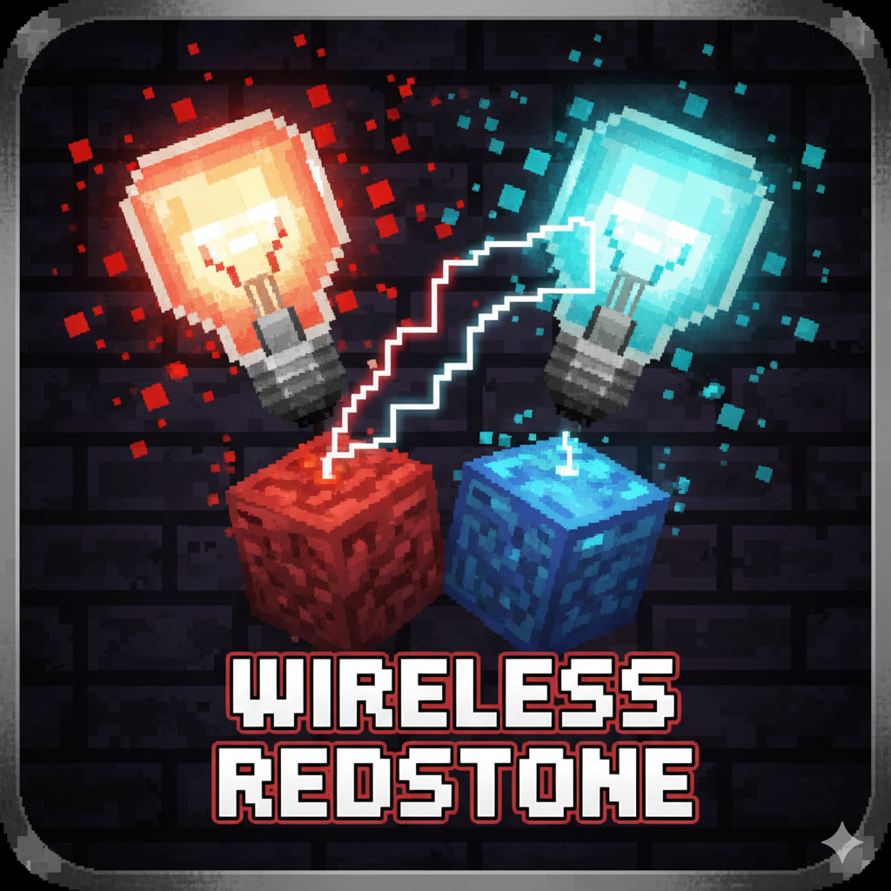
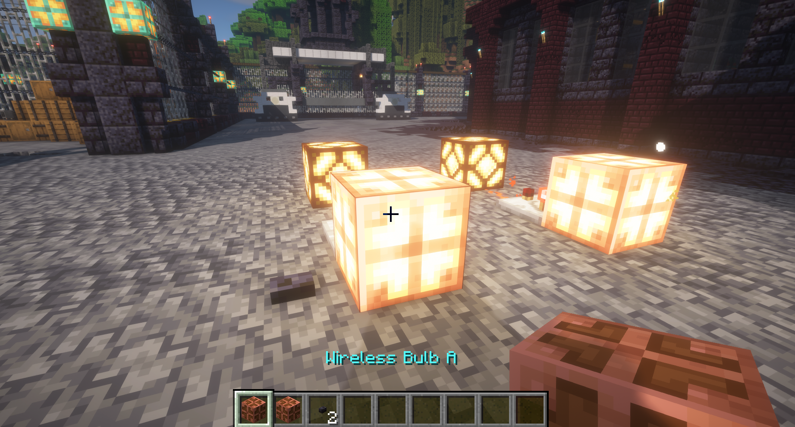
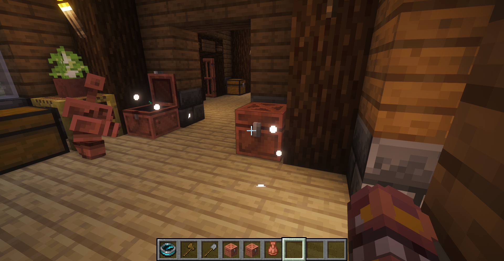
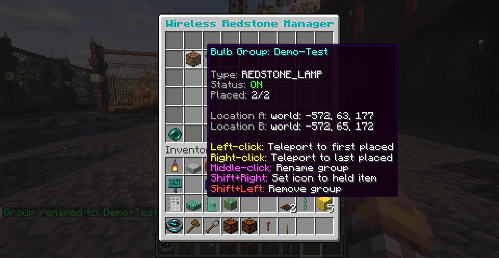

# 📡 Wireless Redstone

**Wirelessly link copper bulbs, redstone lamps, chests, and shulker boxes.** Syncs states and inventories across any distance.

 

  

# Wireless-Redstone

Wireless-Redstone links copper bulbs, redstone lamps, and supported container blocks into synchronized wireless groups that can be managed from commands and GUI tools.

## Features

- Create wireless groups that sync states across any distance
- Support for bulbs, lamps, and container-based linked systems
- Circuit inspector tool for group diagnostics and ownership lookup
- Connector tool for rapid add/remove assignment workflows
- GUI management for categories, naming, icons, recovery, and teleport helpers
- Administrative controls for all-player group visibility and maintenance

## Commands

Main command:

- `/wireless` (alias: `/wr`)

| Command | Description |
| --- | --- |
| `/wireless give bulb [amount]` | Create wireless bulb items |
| `/wireless give lamp [amount]` | Create wireless lamp items |
| `/wireless give chest [amount]` | Create wireless container items |
| `/wireless inspect [player]` | Get or use the circuit analyzer tool |
| `/wireless create <group> [category]` | Get connector tool and prepare a group |
| `/wireless gui [--all|--nocategory]` | Open management interface |
| `/wireless modify name <group> <newName>` | Rename group |
| `/wireless modify category <group> <category>` | Change group category |
| `/wireless append <group> [count]` | Add additional blocks to a group |
| `/wireless recover <group>` | Recover missing or desynced references |
| `/wireless debug on|off` | Toggle debug messages |
| `/wireless reload` | Reload plugin configuration |

## Permissions

| Permission | Default | Description |
| --- | --- | --- |
| `wirelessredstone.use` | op | Use standard wireless commands |
| `wirelessredstone.teleport` | op | Teleport to managed block locations |
| `wirelessredstone.remove` | op | Remove groups and managed blocks |
| `wirelessredstone.admin` | op | Access global and cross-player controls |

## Installation

1. Download the latest jar from Releases.
2. Place the jar in your server `plugins` directory.
3. Restart the server.
4. Assign permissions and optionally adjust group policy defaults.

## Compatibility

- API: Paper/Spigot/Bukkit 1.21+
- Java: 21+

## License

This project is licensed under the MIT License.
---

## 📸 Screenshots

  
   <em>Linked copper bulbs syncing their lit state</em>

  
   <em>Linked chests sharing inventory</em>

  
   <em>Management GUI with categories</em>

---

## 🔐 Permissions

| Permission                  | Description            | Default |
|-----------------------------|------------------------|---------|
| `wirelessredstone.use`      | Use commands           | op      |
| `wirelessredstone.teleport` | Teleport via GUI       | op      |
| `wirelessredstone.remove`   | Remove groups via GUI  | op      |
| `wirelessredstone.admin`    | View all groups        | op      |

---

## 💡 Tips

- **Lost blocks?** Use `/wireless recover <group>` to get items back
- **Chunks must be loaded** for syncing to work
- **Breaking containers** doesn't drop items - they stay in shared inventory
- **WireView mode** automatically toggles when holding the Circuit Analyser

---

## 📄 License

MIT License - see [LICENSE](LICENSE) file

---

Made with ❤️ for the Minecraft community

