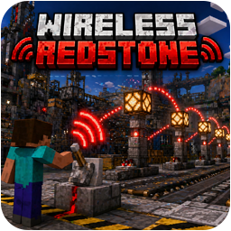

<p align="center">
  
</p>
<h1 align="center">Wireless Redstone Plugin</h1>
<p align="center">
  <b>Wirelessly link copper bulbs, redstone lamps, and container blocks.</b><br>
  <b>State and inventory synchronization across any distance with GUI management.</b>
</p>
<p align="center">
  <a href="https://github.com/Cobbleworks/Wireless-Redstone-Plugin/releases"></a>&nbsp;&nbsp;<a href="https://github.com/Cobbleworks/Wireless-Redstone-Plugin/blob/main/LICENSE"></a>&nbsp;&nbsp;&nbsp;&nbsp;&nbsp;&nbsp;&nbsp;&nbsp;&nbsp;&nbsp;<a href="https://github.com/Cobbleworks/Wireless-Redstone-Plugin/issues"></a>
</p>

Wireless Redstone is an open-source Minecraft plugin that allows players to create named groups of wirelessly linked blocks that synchronize their states or inventories across any distance. Link copper bulbs and redstone lamps into groups that toggle together, or link chests, shulker boxes, and copper chests into shared inventory groups that update in real time. All group data is saved persistently and survives server restarts, with full GUI-based management, a circuit analyser diagnostic tool, a connector tool for rapid assignment, and hopper-compatible container support.

### **Core Features**

- **Wireless Bulbs and Lamps:** Create linked groups of copper bulbs or redstone lamps that synchronize state across any distance (2-26 blocks per group)
- **Wireless Containers:** Create linked groups of chests, barrels, shulker boxes, or copper chests that share inventory in real time
- **Management GUI:** Visual interface for managing all wireless groups with category organization, custom naming, and icon assignment
- **Circuit Analyser:** Diagnostic tool for inspecting wireless blocks with WireView mode showing color-coded glowing outlines per group
- **Connector Tool:** Management tool for rapidly adding or removing blocks from existing groups, with creation mode for building new groups in place
- **Block Recovery:** Recover lost or accidentally broken wireless blocks that still belong to an existing group
- **All Copper Variants:** Full support for normal, exposed, weathered, and oxidized copper bulbs and chests - including all waxed variants
- **All Shulker Colors:** Support for all 17 shulker box colors as wireless container variants
- **Hopper Compatible:** Wireless containers work seamlessly with hoppers for automated item transfer and sorting systems
- **Persistent Data:** All group data is saved automatically and survives server restarts

### **Supported Platforms**

- **Server Software:** `Spigot`, `Paper`, `Purpur`, `CraftBukkit`
- **Minecraft Versions:** `1.21` and higher
- **Java Requirements:** `Java 21+`
- **Dependencies:** None - fully self-contained, no external plugins required

## **Table of Contents**

1. [Getting Started](#getting-started)
    - [Prerequisites](#prerequisites)
    - [Installation Steps](#installation-steps)
    - [First Launch & Configuration](#first-launch--configuration)
    - [Verifying Installation](#verifying-installation)
2. [Configuration](#configuration)
    - [Data Files](#data-files)
3. [How It Works](#how-it-works)
    - [Wireless Bulbs and Lamps](#wireless-bulbs-and-lamps)
    - [Wireless Containers](#wireless-containers)
    - [Connector Tool](#connector-tool)
    - [Circuit Analyser](#circuit-analyser)
4. [Player Commands](#player-commands)
    - [Command Reference](#command-reference)
    - [Variant Flags](#variant-flags)
5. [Permissions](#permissions)
6. [Building from Source](#building-from-source)
7. [License](#license)
8. [Screenshots](#screenshots)

## **Getting Started**

### **Prerequisites**

Before installing Wireless Redstone, confirm the following requirements are met:

- A Minecraft server running **Spigot**, **Paper**, **Purpur**, or any compatible fork
- Server version **1.21 or higher** (`api-version: 1.21` is the minimum)
- **Java 21** or newer installed on the machine running the server
- Operator or console access to install plugin files

No additional plugins or libraries are needed. Wireless Redstone has zero external dependencies.

### **Installation Steps**

1. Download the latest `WirelessRedstone-x.x.x.jar` from the [Releases](https://github.com/Cobbleworks/Wireless-Redstone-Plugin/releases) page
2. **Stop your server completely** before placing any files
3. Copy the `.jar` into your server's `plugins/` directory
4. Start the server - Wireless Redstone generates its configuration folder automatically on first boot

### **First Launch & Configuration**

On the first server start after installation, Wireless Redstone creates the following structure:

```
plugins/
└── WirelessRedstone/
    ├── bulbs.yml        - All bulb and lamp group data
    ├── chests.yml       - All container group data and shared inventories
    └── categories.yml   - Category definitions and icons
```

All data files are managed automatically by the plugin. Do not edit them manually while the server is running - all management is done in-game using the `/wireless` command and GUI. If you make manual edits while the server is stopped, run `/wireless reload` after restarting.

### **Verifying Installation**

- Run `/plugins` in-game - `WirelessRedstone` should appear green in the list
- Run `/version WirelessRedstone` to confirm the installed version matches the release you downloaded
- Run `/wireless` to open the management GUI - a chest inventory should open
- If the plugin fails to load, check the server console for `WirelessRedstone` error messages (common causes: wrong Java version, corrupt JAR, or unsupported API version)

## **Configuration**

### **Data Files**

Wireless Redstone persists all runtime data to YAML files under `plugins/WirelessRedstone/`. These files are written automatically on every change and on server shutdown.

| File | Purpose |
|------|---------|
| `bulbs.yml` | Bulb/lamp groups, ownership, names, category links, variant material, locations |
| `chests.yml` | Container groups, shared inventories, ownership, names, category links, locations |
| `categories.yml` | Category definitions, owners, icons |

> **Note:** Do not edit these files manually while the server is running. Use `/wireless reload` after any manual edits made while the server is stopped.

## **How It Works**

### **Wireless Bulbs and Lamps**

Each wireless group is a named set of copper bulbs or redstone lamps linked by a shared group ID stored in each block's persistent data. When one block in the group is toggled (powered by redstone, clicked, etc.), `BulbSyncTask` propagates the new state to every other block in the same group within the same tick. Groups support 2 to 26 blocks, support all copper weathering/waxing variants and redstone lamps, and can span across any distance - including across dimensions if the chunks are loaded.

The `BulbPlaceListener` captures block placements of custom wireless bulb items, reads their group metadata, and registers the new location. `BulbBreakListener` removes the location from the group when a wireless block is broken. `BulbInteractionListener` handles player interactions and fires the sync.

### **Wireless Containers**

Wireless container groups link chest-type blocks into a shared inventory that all members access simultaneously. When a player opens a wireless chest, barrel, shulker box, or copper chest, the plugin intercepts the `ChestInventoryListener` and presents the group's shared `Inventory` object to the player. Any changes made by any player to any container in the group are reflected in real time across all linked containers.

Hoppers connected to wireless containers interact with the shared inventory directly - items deposited or extracted by hoppers update the shared inventory and are reflected in all linked blocks.

### **Connector Tool**

The Connector Tool is a special item given by `/wireless create`. In **existing-group mode**, right-clicking a compatible block adds it to the group; left-clicking removes it. In **creation mode** (for new groups), the first click registers the first block; subsequent clicks add more. The tool displays a particle outline (via `ConnectorWireViewTask`) around all blocks already in the group so the player can see the current membership while building.

### **Circuit Analyser**

The Circuit Analyser is a diagnostic tool given by `/wireless inspect`. When held, right-clicking any wireless block displays its group name, owner, group size, and current state in chat. WireView mode activates `AnalyserWireViewTask`, which renders color-coded glowing particle outlines around every block in each group - each group gets a unique color so overlapping groups can be distinguished visually.

## **Player Commands**

All commands require the `wirelessredstone.use` permission (operator by default). Admin-specific operations additionally require `wirelessredstone.admin`.

**Aliases:** `/wr`

### **Command Reference**

| Command | Description |
|---------|-------------|
| `/wireless` | Open management GUI (same as `/wireless gui`) |
| `/wireless help` | Show command help |
| `/wireless give bulb [amount] [--variant] [--name=...] [--category=...]` | Give linked copper bulb items |
| `/wireless give lamp [amount] [--name=...] [--category=...]` | Give linked redstone lamp items |
| `/wireless give chest [amount] [--variant] [--name=...] [--category=...]` | Give linked container items |
| `/wireless create <groupName> [categoryName]` | Give a Connector Tool for an existing group, or creation-mode tool for a new group |
| `/wireless inspect [player]` | Give a Circuit Analyser (admin can target another player) |
| `/wireless modify name <groupName> <newName>` | Rename a group |
| `/wireless modify category <groupName> <categoryName>` | Assign group to category (`none` to remove) |
| `/wireless append <groupName> [count]` | Extend an existing group by 1-24 slots (max 26 total) |
| `/wireless recover <groupName>` | Recover unplaced/missing items for a group |
| `/wireless gui [--all] [--nocategory]` | Open management GUI (category view or direct list view) |
| `/wireless debug on\|off` | Toggle sync debug messages |
| `/wireless reload` | Reload configuration files (admin only) |

### **Variant Flags**

`/wireless give bulb` supports:

- `--copper`
- `--exposed`
- `--weathered`
- `--oxidized`

`/wireless give chest` supports:

- `--chest`
- `--barrel`
- `--shulker` plus color variants: `--white`, `--orange`, `--magenta`, `--light-blue`, `--yellow`, `--lime`, `--pink`, `--gray`, `--light-gray`, `--cyan`, `--purple`, `--blue`, `--brown`, `--green`, `--red`, `--black`
- Copper chest variants: `--copper`, `--copper-exposed`, `--copper-weathered`, `--copper-oxidized`, `--copper-waxed`, `--copper-waxed-exposed`, `--copper-waxed-weathered`, `--copper-waxed-oxidized`

## **Permissions**

| Permission | Description | Default |
|------------|-------------|---------|
| `wirelessredstone.use` | Allows using wireless redstone commands | `op` |
| `wirelessredstone.teleport` | Allows teleporting to bulb locations via GUI | `op` |
| `wirelessredstone.remove` | Allows removing bulb groups via GUI | `op` |
| `wirelessredstone.admin` | Allows viewing/managing all players' groups and using admin actions | `op` |

## **Building from Source**

Wireless Redstone uses **Apache Maven** as its build system. The plugin is packaged as a standard JAR with no external runtime dependencies.

**Requirements:**
- Java 21 or newer
- Apache Maven 3.6 or newer

**Steps:**

```bash
# Clone the repository
git clone https://github.com/Cobbleworks/Wireless-Redstone-Plugin.git
cd Wireless-Redstone-Plugin

# Compile and package
mvn clean package
```

The output JAR is written to `target/WirelessRedstone-x.x.x.jar`. Copy it into your server's `plugins/` folder as described in the [Installation Steps](#installation-steps) section.

**Project Structure:**

```
src/main/
├── java/com/wirelessredstone/
│   ├── WirelessRedstonePlugin.java            - Plugin entry point (onEnable / onDisable)
│   ├── command/
│   │   └── WirelessCommand.java               - All /wireless subcommands + tab completion
│   ├── gui/
│   │   ├── BulbManagerGUI.java                - Main management GUI
│   │   ├── CategoryAssignmentGUI.java         - Category assignment GUI
│   │   ├── CategorySelectionGUI.java          - Category selection GUI
│   │   └── GroupEntry.java                    - GUI item entry model
│   ├── listener/
│   │   ├── AnalyserWireViewTask.java          - Analyser WireView particle rendering
│   │   ├── BulbBreakListener.java             - Handles wireless bulb block breaks
│   │   ├── BulbInteractionListener.java       - Handles bulb toggle and sync
│   │   ├── BulbPlaceListener.java             - Registers placed wireless bulb blocks
│   │   ├── ChestBreakListener.java            - Handles wireless container block breaks
│   │   ├── ChestInventoryListener.java        - Shared inventory interception
│   │   ├── ChestPlaceListener.java            - Registers placed wireless container blocks
│   │   ├── ChunkLoadListener.java             - Re-applies block states on chunk load
│   │   ├── CircuitAnalyserListener.java       - Circuit analyser inspection handling
│   │   ├── ConnectorToolListener.java         - Connector tool group build/edit
│   │   ├── GUIListener.java                   - GUI click event handling
│   │   └── WireViewListener.java              - WireView display toggle
│   ├── manager/
│   │   ├── CategoryManager.java               - Category CRUD and YAML persistence
│   │   ├── DebugManager.java                  - Debug logging control
│   │   ├── LinkedBulbManager.java             - Bulb group CRUD, sync, and file persistence
│   │   ├── LinkedChestManager.java            - Container group CRUD, sync, and file persistence
│   │   └── WireViewManager.java               - WireView particle task management
│   ├── model/
│   │   ├── BaseGroup.java                     - Common group data (name, owner, category)
│   │   ├── BulbGroup.java                     - Bulb/lamp group model (variant, locations)
│   │   ├── Category.java                      - Category model (name, icon, owner)
│   │   └── ChestGroup.java                    - Container group model (inventory, locations)
│   ├── task/
│   │   ├── AnalyserWireViewTask.java          - Repeating task for analyser particle display
│   │   ├── BulbSyncTask.java                  - Repeating task for bulb state propagation
│   │   └── ConnectorWireViewTask.java         - Repeating task for connector particle display
│   └── util/
│       ├── BulbUtils.java                     - Copper variant helpers
│       ├── LocationUtils.java                 - World/coordinate serialization
│       └── ParticleEffects.java               - Particle rendering utilities
└── resources/
    ├── config.yml                             - Plugin configuration
    └── plugin.yml                             - Plugin metadata, commands, permissions
```

## **License**

This project is licensed under the **MIT License** - see the [LICENSE](LICENSE) file for details.

## **Screenshots**

The screenshots below demonstrate Wireless Redstone Plugin in action, showcasing wireless activation of factory buttons, disco floor lighting, fence illumination, room machines, bulb command setup, and a lever activating a lamp without any physical connection.

<table>
  <tr>
    <th>Wireless Redstone - Factory Button</th>
    <th>Wireless Redstone - Disco Ground Lightning</th>
  </tr>
  <tr>
    <td><a href="https://github.com/Cobbleworks/Wireless-Redstone-Plugin/raw/main/images/screenshot-factory-button.png" target="_blank" rel="noopener noreferrer"></a></td>
    <td><a href="https://github.com/Cobbleworks/Wireless-Redstone-Plugin/raw/main/images/screenshot-disco-lightning.png" target="_blank" rel="noopener noreferrer"></a></td>
  </tr>
  <tr>
    <th>Wireless Redstone - Factory Fence Lighting</th>
    <th>Wireless Redstone - Room Machines</th>
  </tr>
  <tr>
    <td><a href="https://github.com/Cobbleworks/Wireless-Redstone-Plugin/raw/main/images/screenshot-factory-fence.png" target="_blank" rel="noopener noreferrer"></a></td>
    <td><a href="https://github.com/Cobbleworks/Wireless-Redstone-Plugin/raw/main/images/screenshot-room-machines.png" target="_blank" rel="noopener noreferrer"></a></td>
  </tr>
  <tr>
    <th>Wireless Redstone - Bulb Command</th>
    <th>Wireless Redstone - Lever Activating Lamp</th>
  </tr>
  <tr>
    <td><a href="https://github.com/Cobbleworks/Wireless-Redstone-Plugin/raw/main/images/screenshot-bulb-command.png" target="_blank" rel="noopener noreferrer"></a></td>
    <td><a href="https://github.com/Cobbleworks/Wireless-Redstone-Plugin/raw/main/images/screenshot-lever-lamp.png" target="_blank" rel="noopener noreferrer"></a></td>
  </tr>
</table>
